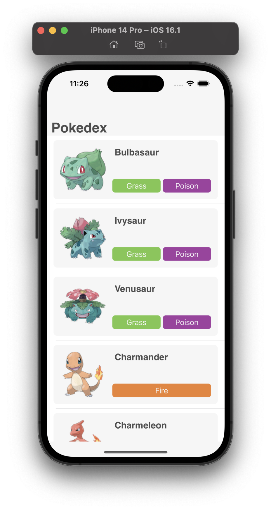
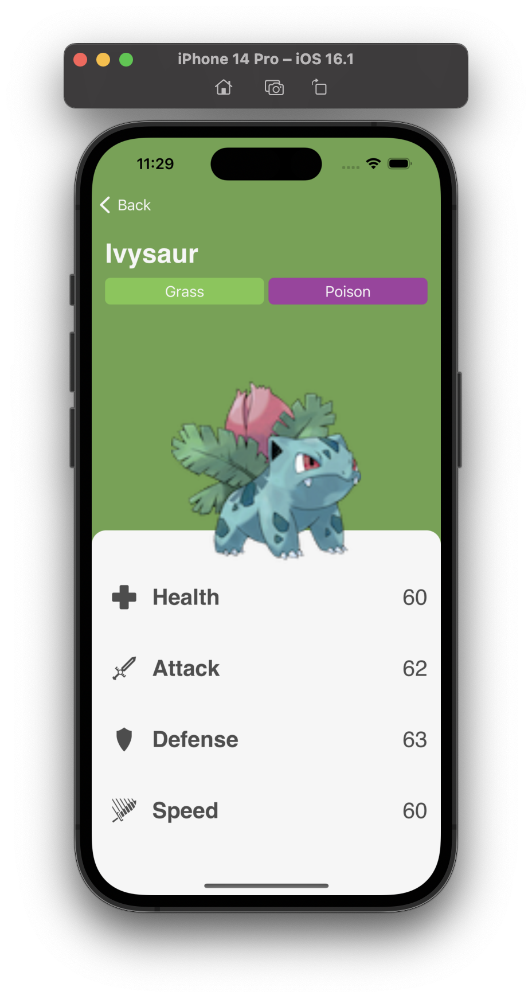
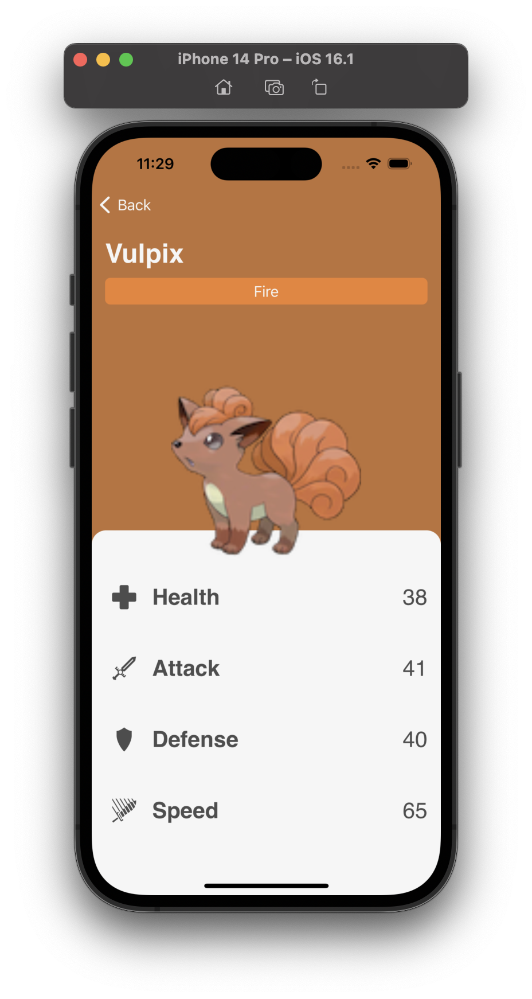
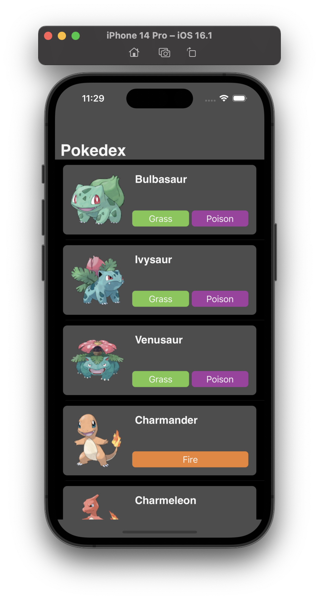
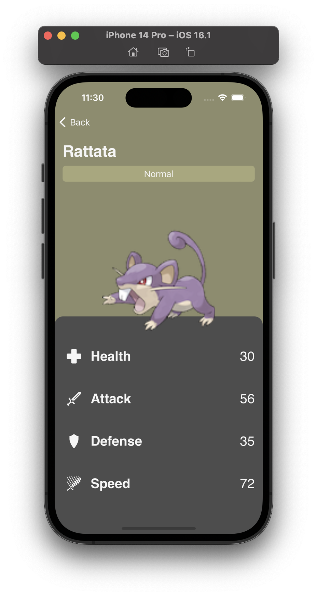

#  Desafio Pokedex

Desenvolva um app que apresenta as informações de stats dos pokemons.

    

    

    

    

    

Dentro do diretório Data existe um json chamado `pokedex.json`, utilize os dados dele para preencher a lista de pokemons.

As imagens dos pokemons estão nos assets, utilizem o `id` para referenciar a imagem.

Dentro dos assets também existe a definição das cores dos tipos de pokemon e os ícones que vocês irão precisar.

## Observações

- A definição de layout é livre, podem fazer idêntico ou apenas usar de inspiração. O importante é que ao menos as informações e as cores exibidas nos prints estejam presentes.
- A fonte utiliza foi `Helvetica`.
- O Dark Mode é opcional, porém os assets providos já estão preparados, analisem eles para entender. 
- **A ordem de execução das tarefas será dada no início da aula**
- **Lembrem de usar MVC**
